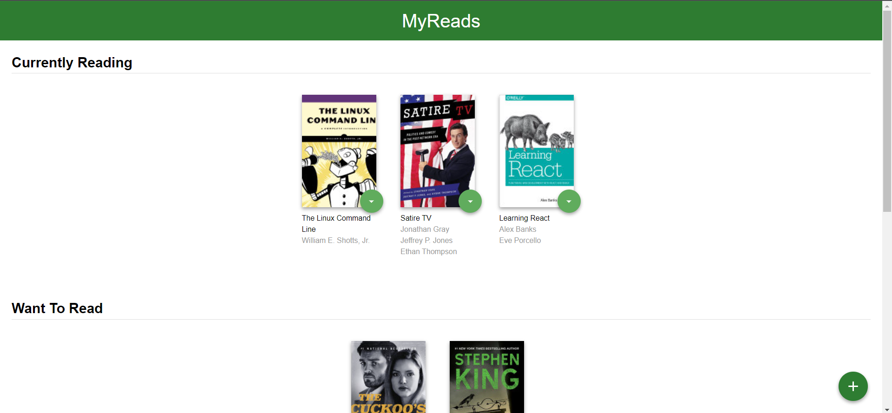
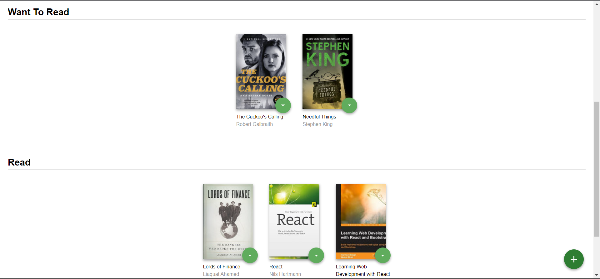
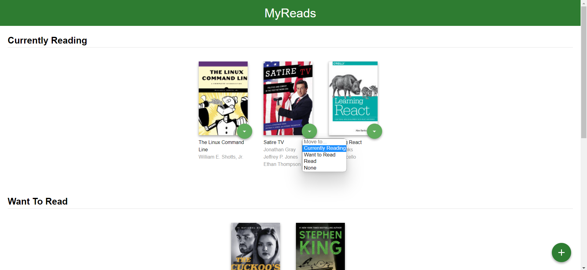
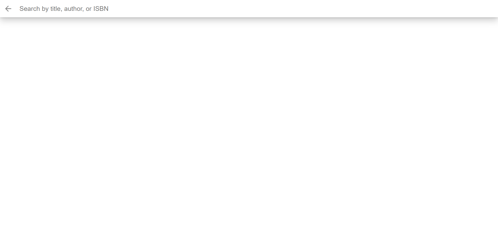
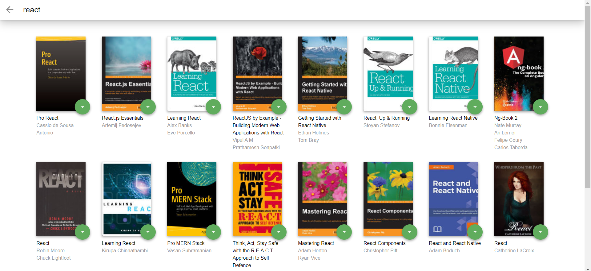

# ⚡MyReads⚡

---

## How to Load the App

The project uses Node.js , if you do not have Node you can download it from: [Node.js](https://nodejs.org/en/)

After Node is installed run this code in your local machine:

```
git clone https://github.com/Ahmed-AboHmaiD/My-Reads.git
npm install
```

After all of the dependencies have been installed you can launch the app with

```
npm start
```

## How to Use the App
There is three shelves (Currently Reading, Want To Read, Read).
<br>
You can change the shelf of the book as you want.
<br>
You can add new book with add button in the bottom right of the page.
<br>








### Resources and Documentation:

- [Create-react-app Documentation](https://reactjs.org/docs/create-a-new-react-app.html)
- [React Router Documentation](https://reactrouter.com/en/main)

### Udacity Resources:

- [Project starter template](https://github.com/udacity/nd0191-c1-myreads/)
- [Project Rubric](https://review.udacity.com/#!/rubrics/3624/view)
